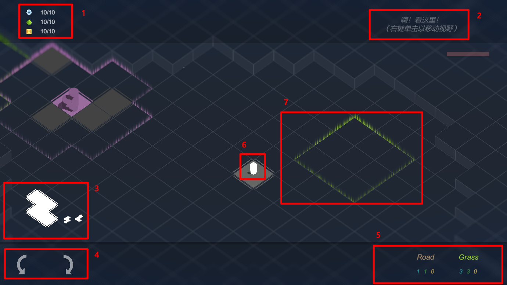

### 游戏说明

#### 界面

1. 资源存量与上限
2. 任务与 Tips，请尽可能完成任务以推进游戏进程
3. 下一个放置的方块形状预览
4. 旋转放置的方块，使用 Q、E 快捷键可以轻松逆时针、顺时针旋转
5. 方块类型，鼠标左键选择后移动到画面中央可以在场上预览方块位置，若为红色则不可放置；右键以取消选择
6. 玩家自身，使用 WASD 控制移动，Space 跳跃
7. 随机生成的增益地形，其中绿色可以增益 Grass 的产出效率，而紫色则可以增益 Factory 的产出效率

#### 视野

使用鼠标右键**单击或长按**移动视角至**鼠标位置**。

#### 游戏目标

活着。

完成任务以获得对生存更有利的方块。

#### 方块种类

玩家可放置

| block type | usage                                | G/F/M |
| ---------: | ------------------------------------ | ----- |
|       ROAD | 普通的路径，其余类型只能在其旁边放置     | 1/1/0 |
|      GRASS | 周期产出FOOD资源(在高处会加速)       | 3/3/0 |
|    FACTORY | 周期产出METAL资源(在矿场周围会加速)  | 3/6/0 |
|     DEFEND | 自动攻击周围的敌人                   | 3/3/6 |
|    STORAGE | 提高资源储存上限，单位提供1的上限    | 2/2/2 |
|     ABSORB | 玩家站立于上可增加吸收周围产物的范围 | 3/2/3 |

固定生成
| BLOCK TYPE | USAGE                               |      |
| ---------: | ----------------------------------- | ---- |
|       ROCK | 岩石，可行走却不能作为道路在其周围放置设施 |      |
|       MINE | 矿物，增幅周围随机地区FACTORY的产速 |      |
|    MIRACLE | 遗迹，击败后增加可以使用方块的种类  |      |

